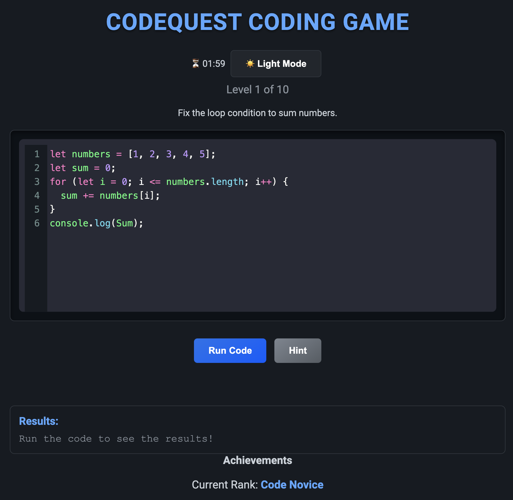
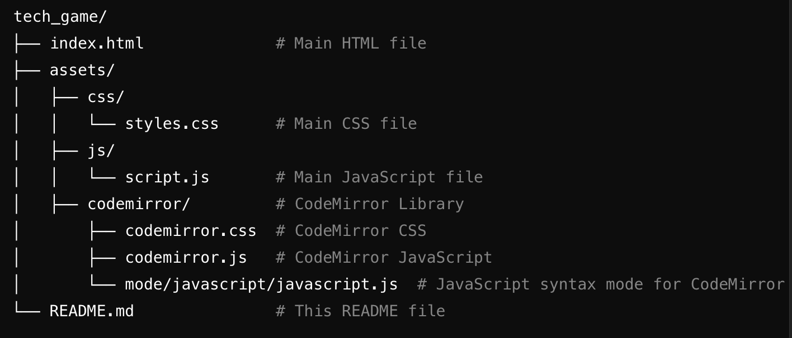

# CodeQuest Coding Game





## Table of Contents
1. [Overview](#overview)
2. [Features](#features)
3. [Demo](#demo)
4. [File Structure](#file-structure)
5. [How It Works](#how-it-works)
6. [Technology Used](#technology-used)
7. [Installation & Setup](#installation--setup)
8. [How to Play](#how-to-play)
9. [Acknowledgments](#acknowledgments)
10. [Author](#author)

---

## Overview
The **Codequest Coding Game** is an interactive web-based game designed to test and improve coding skills. With a modern, polished interface and an integrated IDE powered by CodeMirror, players can solve progressively challenging coding puzzles while enjoying features like real-time feedback, hints, and a light/dark mode toggle.

This project is ideal for showcasing your coding expertise and engaging users with a fun, interactive experience.

---

## Features
### Gameplay
- **10 Levels**: A set of 10 progressively harder coding challenges designed to test problem-solving skills.
- **Interactive IDE**: CodeMirror editor provides syntax highlighting, line numbers, and a real coding environment experience.
- **Hints**: Optional hints to help players solve difficult puzzles.
- **Achievements**: Track progress and unlock new ranks as you complete levels.
  
### Interface
- **Light/Dark Mode**: Dynamic theme toggle for better user experience.
- **Real-Time Feedback**: Players see immediate results of their code execution.
- **Responsive Design**: Works seamlessly across devices, from desktops to mobile phones.

### Fun Elements
- **Celebration Animations**: Players are rewarded with animations and sound effects upon completing levels.
- **Error Handling**: Players are guided with helpful error messages for incorrect solutions.

---

## Demo
You can view the live project demo here:
[Add live project URL if hosted online]

Alternatively, download the project and run it locally. See the [Installation & Setup](#installation--setup) section for instructions.

---

## File Structure




---

## How It Works
### Gameplay Flow
1. **Fix the Code**: Each level presents a coding challenge with a partially incorrect code snippet.
2. **Run the Code**: Click the "Run Code" button to test your solution.
3. **Feedback**: Real-time feedback is displayed in the results section.
4. **Next Level**: Upon solving the current challenge, the "Next Coding Puzzle" button becomes active.
5. **Hints**: Click the "Hint" button for guidance when stuck.
6. **Toggle Mode**: Switch between light and dark themes for an enhanced experience.

### Levels and Ranks
- Players progress through 10 levels, each increasing in complexity.
- Ranks are awarded as players complete levels, starting from "Code Novice" to "Coding Legend."

---

## Technology Used
### Frontend Technologies
- **HTML5**: For structuring the game layout.
- **CSS3**: For styling, animations, and responsive design.
- **JavaScript**: Core logic for game interactions, level progression, and feedback.

### Libraries and Tools
- **CodeMirror**: Provides an integrated coding editor with syntax highlighting and line numbers.
- **Google Fonts**: "Roboto" font for a clean and professional design.

---

## Installation & Setup
### Prerequisites
Ensure you have the following installed:
- A modern web browser (Google Chrome, Firefox, etc.).

### Steps to Run Locally
1. Clone the repository:
   ```bash
   git clone https://github.com/wgwhitecoding/tech_game.git
   cd tech_game


2. Open the `index.html` file in your browser:
No additional setup is required. The game is front-end-only and works directly in the browser.

---

### How to Play
1. Open the game by following the [Installation & Setup](#installation--setup) instructions.
2. Navigate to Level 1, where you’ll see a code snippet in the editor.
3. Read the challenge description and fix the provided code in the editor.
4. Click **Run Code** to check your solution.
5. If the solution is correct:
   - A celebration animation will appear.
   - The "Next Coding Puzzle" button will become active.
6. If the solution is incorrect:
   - An error message will guide you toward fixing the code.
7. Use the **Hint** button if you get stuck.
8. Progress through all 10 levels to become a **Coding Legend**!

---

### Acknowledgments
- **CodeMirror**: [https://codemirror.net/](https://codemirror.net/)
- **Google Fonts**: [https://fonts.google.com/](https://fonts.google.com/)

Special thanks to all the open-source libraries and tools that made this project possible.

---

### Author
**Created by:** [Walid Will Gailey White](https://github.com/wgwhitecoding)

If you have any questions, feel free to reach out via GitHub or open an issue in the repository.

---


